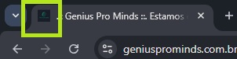

# Como eu adiciono um icone na página?



Primeiro é necessário ter o arquivo favicon.

Para transformar qualquer imagem em um ícone (favicon) exibido no topo da aba do navegador, você pode utilizar o seguinte site:

https://www.online-convert.com/

Com o arquivo ícone (favicon) criado, você pode usar a tag <link> dentro do <head> do seu documento. Aqui está um exemplo básico:

```html
<head>
  <link rel="icon" href="caminho/para/seu/favicon.ico" type="image/x-icon">
</head>
```


🛠️ Dicas úteis:
O arquivo .ico deve estar acessível no caminho especificado.

Você também pode usar outros formatos como .png ou .svg, por exemplo:

```html
<link rel="icon" href="favicon.png" type="image/png">
```

Para garantir compatibilidade com navegadores antigos, você pode adicionar:

```html
<link rel="shortcut icon" href="favicon.ico" type="image/x-icon">
```
